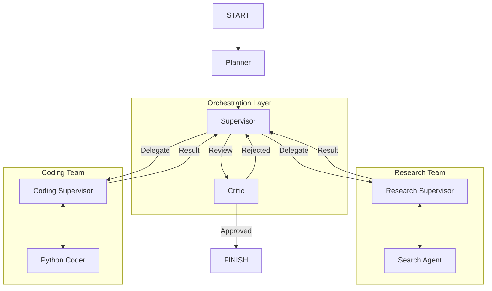

# Architecting Professional-Grade Multi-Agent Systems with LangGraph


A professional-grade Multi-Agent System (MAS) implementing advanced cognitive architectures using **LangGraph**. This project demonstrates a **Hierarchical ReAct** pattern with **Planning**, **Reflection (Criticism)**, and **Team-based delegation**.

## 🏗️ Architecture

The system uses a sophisticated graph topology where a top-level **Planner** decomposes tasks, a **Supervisor** delegates to specialized **Teams**, and a **Critic** reviews the final output.



## ✨ Key Features

- **🧠 Planner Agent**: Decomposes complex user requests into a structured "Tree of Thoughts" plan before execution begins.
- **👔 Hierarchical Teams**:
    - **Research Team**: Specialized subgraph for gathering information using Tavily Search.
    - **Coding Team**: Specialized subgraph for generating and verifying Python code.
- **🧐 Critic Agent**: Implements a "Reflection" step to review outputs for quality, completeness, and safety before presenting them to the user.
- **🚦 Supervisor Router**: Intelligent routing based on current state and plan progress.
- **🐳 Production Ready**: Fully containerized with Docker and exposed via a FastAPI interface with Server-Sent Events (SSE) for real-time streaming.

## 🚀 Getting Started

### Prerequisites

- Python 3.11+
- Docker (optional)
- API Keys:
    - `OPENAI_API_KEY`
    - `TAVILY_API_KEY`
    - `LANGCHAIN_API_KEY` (for LangSmith tracing)

### Local Installation

1.  **Clone the repository**:
    ```bash
    git clone https://github.com/yourusername/multi-agent-system.git
    cd multi-agent-system
    ```

2.  **Set up environment**:
    ```bash
    cp .env.example .env
    # Edit .env with your API keys
    ```

3.  **Install dependencies**:
    ```bash
    python -m venv venv
    source venv/bin/activate
    pip install -r requirements.txt
    ```

4.  **Run the Agent**:
    ```bash
    python main.py
    ```

### Docker Deployment

1.  **Build the image**:
    ```bash
    docker-compose build
    ```

2.  **Run the service**:
    ```bash
    docker-compose up
    ```

3.  **Access the API**:
    The API will be available at `http://localhost:8000`.
    - **Swagger UI**: `http://localhost:8000/docs`
    - **Chat Endpoint**: `POST /chat`

## 🧪 Testing

Run the comprehensive test suite to verify all agents and graph topologies:

```bash
pytest tests
```

## 🗺️ Roadmap

- [x] **Phase 1**: Prototype (Happy Path)
- [x] **Phase 2**: Tool Integration & Error Handling
- [x] **Phase 3**: Token Optimization
- [x] **Phase 4**: Evaluation & Testing
- [x] **Phase 5**: Deployment (Docker/FastAPI)
- [x] **Phase 6**: Advanced Architecture (Planner, Critic, Hierarchical Teams)
- [ ] **Phase 7**: Enterprise Scaling (Persistence, Human-in-the-loop)

## 📄 License

MIT
